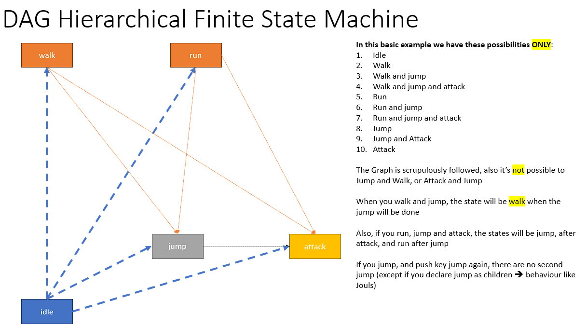

# Implementation of DAG for FSM

Finite State Machine allows game developpers to manage state of objects (i.e. player, foes)

This code implements :

	- FSM with DAG (Direct Acyclic Graph) 
	- an example : a physical object reacting with input event (jump, run, change direction...) 

## DAG

### Why DAG and not Code directly

The first motivation is to have a flexible tool to manage FSM, when starting a new game, the state of an object is ready only by writing a JSON file instead of writing code.

The second motivation is to leverage DAG algorythm used in computer science (like Terraform for Infra-as-code).

And more:

DAG is implemented in json file, well supported in Godot (JSON saving and loading, Dictionnary and Array objects for mapping).

The DAG depicts the relation between states, what is allowed/forbid for a given state, the code is generic and follow the Graph.

It avoids to create boiler-plate code

It allows to implement complex behaviour (multiple DAG for the same object, very complex states path, ...) with no additional code

## Content

DAG class

AnimatableCharacterBody2D class

	demostration of a ship obeying to a DAG in json


### DAG Fields

Structure:

	root is the default DAG, it contains direction (right by default meaning Vector2.RIGHT in Godot) and states

	direction: right or left 

	states: contains array of these elements below

Repeated elements in states:

	node_name: is the UNIQUE name of the node, it is referenced in the children array. The layer 0 is the default one, one node is expected "idle" with no parent.

	layer: is a group of nodes with the same level, an object applying DAG-FSM (a player...) could not have in the same time 2 nodes of the same layer.

	parent: is the default node in case of falling back from a node above (from a upper layer).

	children: the list of possible path for a node given, for example when you are firing you could not do something else.

### DAG calculated Fields

The code calculates the layer count, it's the different layers count, if you have layer 0, layer 100, layer 200 , the count is 3.


````json
{
  "root": { 
	"direction": "right", 
	"states": [
		{
		   "node_name": "idle",
			"layer": 0,
			"parent": ""
			"children": [
				"walk",
				"run",
				"jump",
				"attack",
			],
		},
		{
		   "node_name": "walk",
			"layer": 10,
			"parent": "idle"
			"children": [
				"jump",
				"attack",
			],
		},
		{
		   "node_name": "run",
			"layer": 10,
			"parent": "idle",
			"children": [
				"jump",
				"attack",
			],
		},
		{
		   "node_name": "jump",
			"layer": 20,
			"parent": "idle",
			"children": [
				"attack",
			],
		},
		{
		   "node_name": "attack",
			"layer": 30,
			"parent": "idle",
			"children": [],
		},
		]
	}
}
````

## Theory of DAG and FSM



Theory, default rules:

	parallel nodes   : node in the same layer. When going to this node it's NOT POSSIBLE to go to another node in the same layer
	serial nodes     
		when going to a node to another layer, it's a one way path, if you go back you follow the same path in the reverse way
	
	history : for managing the node to node state an Array hold the history, the stack size is the number of layer
		history[].size = layer.count


For example:

	Player walk, jump and attack
	(idle -> walk -> jump -> attack)
	
	Then release attack input
	(idle -> walk -> jump)
	
	Then release jump
	(idle -> walk)

When going from node to node, a stack is managed, tracking state

A node_name is the point where a decision path is expected, there are x cases:

- nothing, it's the final state, there is no more actions possible (children is empty array)
- actions available, children nodes array contains all possibilities
- finished action, at each node by default when finishing (jump, attack, ...) the state returned to the node before (history), but, a default node is mandatory to manage the falling back. When going to idle, the history is cleaned
